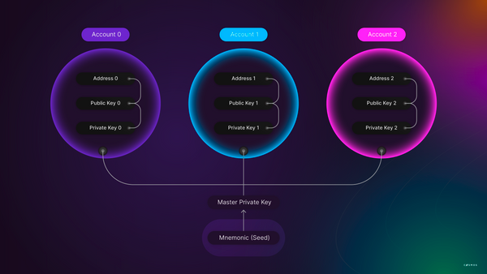

## Accounts

- 하나의 account는 공개키와 비밀키 한쌍이다.
- 비밀키는 정보를 서명하는데 사용되고, 이 방법을 통해 다른 사람들에게 메시지가 해당 주어진 공개키에 해당하는 비밀키를 소유한 사람이 서명했을을 증명한다. 이 작업은 비밀키를 노출하지 않아도 된다!

### 공개키 암호화

- 비대칭 암호 방식을 사용해서, private key가 노출되지 않는다.
    - 인증 : pubkey는 private key가 맞는지 확인 할 수 있는 도구
    - 암호화 : private key만 pubkey로 암호화한 것을 복호화할 수 있음.
- 비대칭 암호 방식에서 “인증” 기능에 주목
- 공개키 암호화방식은 기밀성, 신뢰성, 거부 방지 기능을 제공해서 SSL, TLS 와 같은 표준에도 쓰이고 있음
- 이메일 보안 기술 [PGP](https://m.blog.naver.com/PostView.naver?isHttpsRedirect=true&blogId=wnrjsxo&logNo=221161639001) 에서는 비대칭, 대칭 암호화 방식이 같이 쓰이는 경우도 있긴 함
- **키의 길이가 매우 중요함**, 보통 비대칭 암호화 방식에서 키는 매우 긴 값을 사용함. 키가 길 수록, 해킹하기 어렵고, brute force attack(특정 암호를 풀기위해 가능한 모든 값을 대입하는 방법)으로만 해킹이 가능함

### 서명과 검증

- Alice는 Bob의 메시지가 Bob이 작성한게 맞는지 확신하고 싶다.
    - Bob이 Alice에게 공개키를 제공한다.
    - Bob은 그의 메시지를 비밀키로 서명한다.
    - Bob은 Alice에게 메시지와 서명을 보낸다.
    - Alice는 서명을 Bob의 공개키로 검증한다.
- Alice는 서명이 Bob의 비밀키로 서명이 되었는지 공개키로 검증 할 수 있다.
- 비밀키는 메시지가 account의 소유자로 부터 유래했음을 증명하는데 사용된다.
- 서명(Signature)은 메시지가 주어진 공개키에 해당하는 비밀키로 되었음을 서명되었음을 증명한다.

### 계층 결정론적 지갑 (****Hierarchical-deterministic wallets)****



- 어떻게 여러 블록체인에 대해  여러 key pairs를 관리할까?
- 니모닉 하나로 여러 accounts를 관리할 수 있는 비밀
- 계층 결정론적 지갑은 하나의 seed phrase로 여러 key pairs를 생성하는 방법임. 이 방법을 통해 복잡성을 줄일 수 있음. 사용자는 seed phrase만 백업하면됨!
- Cosmos SDK는 BIP32을 사용함
    - 비트코인에서 사용하고 있는 계층 결정론적 지갑 제안이며, 현재 대부분의 블록체인은 이 표준을 사용하고 있음.
- 주관적인 생각 : 독특한 점은, pubkey와 address가 다르다는 점. 코스모스 체인들은 다 고유의 address체계를 가지고 있다는 점에서 차별점인듯? terra주소는 terra로 시작하는 것처럼.

**BIP32, BIP39, BIP44 자세히 보기**

- **BIP32** : 계층 결정론적 지갑을 위한 시드 표준
- **BIP39** : HD wallet의 시드를 어떻게 단어로 연결할래
- **BIP44**: 여러 계정을 가지고 있는 HD Wallet의 지갑 구조.  즉 m/44'/4'/0'/0/0`를 사용하는 path
- BIP32/39/44 compatiable = 12~24 words를 시드 문구로 생성 가능하다는 것 을 의미


**m/44'/4'/0'/0/0 ??**

- m / purpose' / coin_type' / account' / change / address_index
- m은 컨밴션, 마스터를 의미
- purposerk 44는 BIP43 추천인 BIP44를 사용하겠다는 뜻. 노드 서브트리를 어떻게 그릴지 알려줌
- cointype은 bitcoin, bitcoin testNet인지를 표현, 이더리움은 60을 사용함
- account는 0에서 증가하는 모양, 사용자는 쓰임새에 맞게 account를 구분할 수 있음 → 여기서의 account는 여러 타입의 wallet을 구분하려는 의도이며 우리가 일반적으로 알고 있는 account가 아님
- change. 0은 external(밖으로 보이는 주소), 1은 internal(밖에 보이지 않고, 트랜잭션에서 남은 돈을 받기 위한 지갑)을 의미한다.
- index : 0부터 증가하는 구조이며, BIP32의 child를 derivation할때 쓰임. 다른 account를 만들면 Index가 증가함!!

**예시**

하나의 seed가 있을때,

첫번째 계정은 **m/44'/4'/0'/0/0**

두번째 계정은 **m/44'/4'/0'/0/1** 

결론 : 대부분의 블록체인이 위 표준을 따르기 때문에 하드웨어 월렛 하나로 여러 블록체인을 사용할 수 있게됨. 나노 렛져는 비트코인, 이더리움, 테라, 다양한 네트워크를 사용할 수 있음.

### Keyring, addresses, and address types

- Cosmos SDK에서 keys는 [keyring](https://github.com/cosmos/cosmos-sdk/blob/master/crypto/keyring/keyring.go)이라 부르는 오브젝트에 저장 및 관리됨
- 인증은 서명 검증으로 구현됨
    - 유저가 트랜잭션을 생성하고, 트랜잭션에 서명하고, 서명된 트랜잭션을 블록체인에 보냄
    - 서명값(Signature)이 Sender가 서명한게 맞는지 확인하고 아닐 경우 거부한다.

```jsx
"Message": {
  "Payload": {
    "Sender": "0x1234",
    "Data": "Hello World"
  },
  "Signature": "0xabcd"
}
```

### Signature schemes

Cosmos SDK는 아래의 digital key schems를 지원함. secp256k1, secp256r1, tm-ed24419


### Accounts

Cosmos SDK에서 사용하는 BaseAccount struct

```jsx
type BaseAccount struct {
	Address       string     `protobuf:"bytes,1,opt,name=address,proto3" json:"address,omitempty"`
	PubKey        *types.Any `protobuf:"bytes,2,opt,name=pub_key,json=pubKey,proto3" json:"public_key,omitempty"`
	AccountNumber uint64     `protobuf:"varint,3,opt,name=account_number,json=accountNumber,proto3" json:"account_number,omitempty"`
	Sequence      uint64     `protobuf:"varint,4,opt,name=sequence,proto3" json:"sequence,omitempty"`
}
```

### Public keys

일반적으로 공개키가 accounts를 참조하기 위해 사용하지 않는다.

(이더리움에서도 address는 공개키의 마지막 20bytes로 사용하고 있음)

### Addresses

Address는 account를 참조하기 위해 사용되는 공개된 정보다.

ADR-28를 이용해서 만들며,  아래 세 가지 유형의 주소로 계정을 사용할 때 context를 결정함

- AccAddress : 메시지를 보내는 유저를 식별함
- ValAddress : 검증자 연산자를 식별
- ConsAddress : 합의에 참여하고 있는 검증가 노드를 식별함

### 요약

- 비대칭 암호화방식에서 차용한 account를 사용함.
- 계층 결정론적 지갑은, 하나의 seed에서 여러 account를 만드는 구조인데 이는 BIP32를 참조함
- Account는 address, pubKey, privKey 등으로 이루어짐.